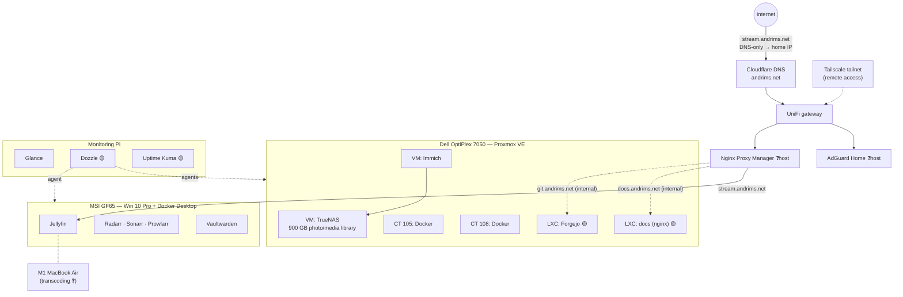

# Aadil's Homelab

A Proxmox-based homelab with a Windows Docker host, a dedicated monitoring Pi, and a UniFi network. Public DNS is on Cloudflare (`andrims.net`); remote access is over Tailscale.

**Status legend:** ✅ running · 🟡 planned / in progress · ❓ unknown or unconfirmed

## At a glance

| Machine | Role | Runs |
|---|---|---|
| [Dell OptiPlex 7050](hardware/optiplex-7050.md) | Proxmox VE host | TrueNAS VM, Immich VM, Docker-in-LXC containers (CT 105, CT 108), more LXCs |
| [MSI GF65](hardware/msi-gf65.md) | Windows 10 Pro + Docker Desktop | Jellyfin, Servarr stack (Radarr, Sonarr, Prowlarr), Vaultwarden |
| [Monitoring Pi](hardware/monitoring-pi.md) | Raspberry Pi, monitoring only | Glance dashboard |
| [M1 MacBook Air](hardware/macbook-air.md) | Jellyfin hardware transcoding | ❓ see page |
| [MSI Raider GE68 HX](hardware/msi-raider-ge68hx.md) | Main personal workstation | Win 11 / CachyOS dual-boot |

## Services

| Service | Status | Host | Exposure |
|---|---|---|---|
| [Vaultwarden](services/vaultwarden.md) | ✅ | MSI GF65 (Docker Desktop) | ❓ |
| [Immich](services/immich.md) | ✅ | Proxmox VM | ❓ |
| [TrueNAS](services/truenas.md) | ✅ | Proxmox VM | Internal |
| [Paperless-ngx](services/paperless-ngx.md) | ✅ | ❓ | ❓ |
| [Jellyfin](services/jellyfin.md) | ✅ | MSI GF65 | **Public** — `stream.andrims.net` |
| [Servarr stack](services/servarr.md) | ✅ | MSI GF65 (Docker Desktop) | ❓ |
| [Nginx Proxy Manager](network/reverse-proxy.md) | ✅ | ❓ | Receives external HTTPS |
| [AdGuard Home](network/dns-adguard.md) | ✅ | ❓ | Internal DNS |
| [Glance](services/glance.md) | ✅ | Monitoring Pi | ❓ |
| [Dozzle](services/dozzle.md) | 🟡 | Monitoring Pi + agents | Internal |
| [Uptime Kuma](services/uptime-kuma.md) | 🟡 | Monitoring Pi | Internal |
| [Forgejo](services/forgejo.md) | 🟡 | Proxmox LXC | Internal — `git.andrims.net` |
| [Docs site](services/docs-site.md) | 🟡 | Proxmox LXC | Internal — `docs.andrims.net` |

## Network map

## Where to start

- Filling gaps: [Open questions](open-questions.md) lists every ❓ in one place.
- What's next and the standing rules: [Roadmap & rules](roadmap.md).
- Adding a new service: copy [the service template](templates/service.md).
