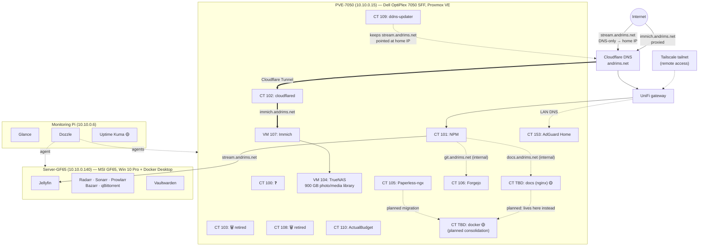

# Aadil's Homelab

A Proxmox-based homelab with a Windows Docker host, a dedicated monitoring Pi, and a UniFi network. Public DNS is on Cloudflare (`andrims.net`); two services are public (Jellyfin and Immich); everything else is internal, with remote access over Tailscale.

**Status legend:** ✅ running · 🟡 planned / in progress · ❓ unknown or unconfirmed

## At a glance

| Machine | Hostname | LAN IP | Role | Runs |
|---|---|---|---|---|
| [Dell OptiPlex 7050 SFF](hardware/optiplex-7050.md) | `PVE-7050` | `10.10.0.15` | Proxmox VE host | TrueNAS (VM 104), Immich (VM 107), NPM (CT 101), cloudflared (CT 102), Paperless-ngx (CT 105), Forgejo (CT 106), ddns-updater (CT 109), ActualBudget (CT 110), AdGuard (CT 153); CT 100, 103 and 108 are old/retiring, being consolidated — see [Roadmap](roadmap.md#planned) |
| [MSI GF65](hardware/msi-gf65.md) | `Server-GF65` | `10.10.0.140` | Windows 10 Pro + Docker Desktop | Jellyfin, Servarr stack (Radarr, Sonarr, Prowlarr, Bazarr, qBittorrent), Vaultwarden |
| [Monitoring Pi](hardware/monitoring-pi.md) | ❓ | `10.10.0.6` | Raspberry Pi, monitoring only | Glance dashboard, Dozzle |
| [MSI Raider GE68 HX](hardware/msi-raider-ge68hx.md) | ❓ | DHCP | Main personal workstation (Windows 11) | Nothing — client |
| [M1 MacBook Air](hardware/macbook-air.md) | ❓ | DHCP | Secondary personal computer | Nothing — client |

## Services

Domain and direct LAN links for every service are on [Services → Quick links](services/index.md#quick-links).

| Service | Status | Host | Exposure |
|---|---|---|---|
| [Vaultwarden](services/vaultwarden.md) | ✅ | Server-GF65 (Docker Desktop) | Internal — [vault.andrims.net](https://vault.andrims.net) |
| [Immich](services/immich.md) | ✅ | VM 107 on PVE-7050 | **Public** — [immich.andrims.net](https://immich.andrims.net) (Cloudflare Tunnel) |
| [TrueNAS](services/truenas.md) | ✅ | VM 104 on PVE-7050 | Internal — [truenas.andrims.net](https://truenas.andrims.net) |
| [Paperless-ngx](services/paperless-ngx.md) | ✅ | CT 105 on PVE-7050 | Internal — [paperless.andrims.net](https://paperless.andrims.net) |
| [Jellyfin](services/jellyfin.md) | ✅ | Server-GF65 | **Public** — [stream.andrims.net](https://stream.andrims.net) |
| [Servarr stack](services/servarr.md) | ✅ | Server-GF65 (Docker Desktop) | Internal — [servarr.andrims.net](https://servarr.andrims.net) (+ per-app paths) |
| [Nginx Proxy Manager](network/reverse-proxy.md) | ✅ | CT 101 on PVE-7050 | Receives external HTTPS — admin at [nginx.andrims.net](https://nginx.andrims.net) |
| [AdGuard Home](network/dns-adguard.md) | ✅ | CT 153 on PVE-7050 | Internal DNS — admin at [dns.andrims.net](https://dns.andrims.net) |
| [Glance](services/glance.md) | ✅ | Monitoring Pi | Internal — [dash.andrims.net](https://dash.andrims.net) |
| [Dozzle](services/dozzle.md) | ✅ | Monitoring Pi + agents | Internal — [dozzle.andrims.net](https://dozzle.andrims.net) |
| [Uptime Kuma](services/uptime-kuma.md) | 🟡 | Monitoring Pi | Internal — [uptime.andrims.net](https://uptime.andrims.net) |
| [Forgejo](services/forgejo.md) | 🟡 | CT 106 on PVE-7050 | Internal — [git.andrims.net](https://git.andrims.net) |
| [ActualBudget](services/actualbudget.md) | ✅ | CT 110 on PVE-7050 | Internal — ❓ |
| [Docs site](services/docs-site.md) | 🟡 | CT (TBD) on PVE-7050 | Internal — [docs.andrims.net](https://docs.andrims.net) |

## Network map

## Where to start

- Filling gaps: [Open questions](open-questions.md) lists every ❓ in one place.
- What's next and the standing rules: [Roadmap & rules](roadmap.md).
- Adding a new service: copy [the service template](templates/service.md).
