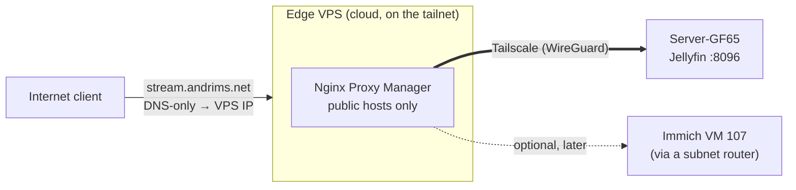

# Edge VPS (planned)

> **What / why:** A small cloud VM that becomes the only public entry point. Public DNS points at the VM, not at the house, and the VM forwards traffic to the lab over Tailscale. The home IP then appears nowhere in public DNS, and ports 80/443 can be closed on the UX7.

**Status:** 🟡 planned, not started. Nothing on this page exists yet.

Other ways to do this, with budgets: [Jellyfin exposure options](jellyfin-exposure-options.md).

## The idea

Today, `stream.andrims.net` → home IP → UniFi port-forward 443 → NPM (CT 101) → Jellyfin. With the VPS, the path becomes `stream.andrims.net` → VPS IP → NPM on the VPS → Tailscale → Jellyfin on the GF65. The home NPM (CT 101) keeps serving internal names only.

## What it fixes

| Problem today | After the VPS |
|---|---|
| Home IP is public through `stream` → `aultmain` | Public DNS holds the VPS IP. The home IP isn't published anywhere. |
| NPM is reachable from the internet, so internal proxy hosts can be requested by hostname (see [Cloudflare → Home IP exposure](cloudflare.md#home-ip-exposure)) | Close ports 80/443 on the UX7. Nothing at home is reachable from outside, so no Access List is needed for this. |
| Immich's planned move off the tunnel would publish the home IP | Immich can go through the VPS instead, with no 100 MB Cloudflare cap. This removes the conflict with [rule 4](../roadmap.md#standing-rules). |
| [ddns-updater](../proxmox/ip-ctid-table.md) (CT 109) must keep `aultmain` current | Not needed for public hosts. Retire it once nothing points at `aultmain`. |

## What it doesn't fix

- The **VPS IP** is public instead. That's the point, but the VPS is now the internet-facing machine and needs patching, SSH hardening and a firewall.
- Anyone who compromises the VPS is **on your tailnet**. Limit what it can reach (next section). A design where the VM holds only one tunnel to the GF65 has a smaller blast radius: see [option B](jellyfin-exposure-options.md#b-edge-vps-pangolin-or-plain-wireguard).
- The VPS (and its provider) can see the **home IP**: a direct WireGuard connection shows it as the peer address. It stops being public, not secret.
- The VPS sees all Jellyfin traffic in the clear after TLS ends, so treat it as trusted infrastructure.

## Design notes

**Lock the VPS down in Tailscale.** Tag it (for example `tag:edge`) and write an ACL so it can reach only the ports it proxies, e.g. `10.10.0.140:8096` (Jellyfin) and nothing else. Without this, a compromised VPS has the whole tailnet.

**Certificates.** Let's Encrypt works normally on the VPS, since its ports 80/443 are public. Use the HTTP challenge for `stream.andrims.net`.

**Real client IPs.** NPM on the VPS sees the real client IP, but Jellyfin will see the VPS's Tailscale IP. Send `X-Forwarded-For`/`X-Real-IP` and add the VPS's Tailscale IP to Jellyfin's known proxies (Dashboard → Networking), or logs and any IP-based rules will be wrong.

**Speed.** Video goes VPS → home over WireGuard. If the two nodes get a **direct** connection it's fast. If Tailscale falls back to a **DERP relay**, throughput drops sharply. Check with `tailscale status` on the VPS. Home upload speed is the ceiling either way.

**Bandwidth.** Oracle's free tier includes 10 TB/month of outbound traffic, plenty for personal streaming. But the free **AMD micro** shape is capped at **50 Mbps**, which is too little for more than a stream or two. Use the free **Ampere A1** shape instead.

**Oracle Free Tier cautions.** Oracle reclaims an Always Free instance that stays under 20% CPU and network use for 7 days, which a quiet proxy could do. Keep the config documented (no secrets) so the VM is quick to recreate. Provider comparison, prices and alternatives: [Jellyfin exposure options](jellyfin-exposure-options.md#vps-providers-and-budgets).

**Keep the tunnel for now.** Vaultwarden and Seerr already avoid the home IP through the Cloudflare Tunnel. They can stay there. Moving them to the VPS is optional and would mean two public paths to maintain.

## Rollout order

1. Create the VM (small ARM or AMD free-tier shape, Debian or Ubuntu). Firewall: allow 80/443 to the world, SSH only from your IP or Tailscale.
2. Install Tailscale, apply the `tag:edge` tag and the restrictive ACL.
3. Install NPM (Docker), add a proxy host for `stream.andrims.net` → `100.x.x.x:8096` (the GF65's Tailscale IP), request the cert.
4. Test by editing your hosts file to point `stream.andrims.net` at the VPS IP. Confirm playback and check `tailscale status` for a direct connection.
5. Change the Cloudflare record for `stream.andrims.net` from the `aultmain` CNAME to an **A record → VPS IP** (DNS only).
6. Wait out the DNS TTL, then **remove the port forwards 80/443** on the UX7.
7. Delete `aultmain.andrims.net`, retire CT 109, then update the docs below.

## Docs to update when it goes live

- [Cloudflare](cloudflare.md): DNS records table and Home IP exposure section.
- [Network overview](index.md): traffic flow and port forwards (both forwards removed).
- [Reverse proxy](reverse-proxy.md): drop `stream.andrims.net` from CT 101 and note the second NPM.
- [IP / CTID table](../proxmox/ip-ctid-table.md): remove CT 109 if retired.
- [Tailscale](tailscale.md): add the VPS to the device list and record the ACL.
- [Changelog](../changelog.md), and a service page for the VPS.

## Details to fill in

| | |
|---|---|
| **Provider / region / shape** | ❓ (Oracle Free Tier considered; see [providers and budgets](jellyfin-exposure-options.md#vps-providers-and-budgets)) |
| **Public IP** | ❓ (don't record it in this public repo; reference Vaultwarden) |
| **Tailscale name / IP** | ❓ |
| **SSH access** | ❓ key-only, from where |
| **NPM admin** | ❓ how it's reached (Tailscale only, never public) |
| **Backups** | ❓ NPM config export |
