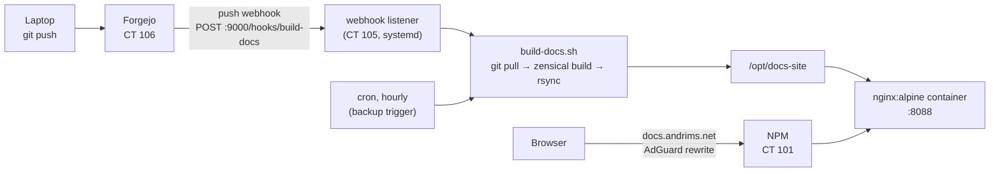

# Docs site

> **What / why:** Renders this repo as a browsable site at `docs.andrims.net`, rebuilt automatically every time a commit is pushed to Forgejo.

**Status:** ✅ operational at [docs.andrims.net](https://docs.andrims.net) and [http://10.10.0.105:8088](http://10.10.0.105:8088), served from the nginx container on **CT 105 (`docker`)**. Automatic rebuild-on-push via webhook is configured.

## How it works

Three pieces, each doing one job:

| Piece | Job | Runs where |
|---|---|---|
| **Forgejo** | Stores the Markdown source. Doesn't render MkDocs/Zensical sites. | CT 106 |
| **Zensical** | Builds the Markdown into static HTML in `site/`, then exits. It is **not** a service. (`zensical serve` is only for live preview on a laptop.) | CT 105 (`docker`), run on demand |
| **nginx** | Serves the built static files. This is the actual "docs" service. | `nginx:alpine` container on CT 105 (`docker`) |



**Why not serve it from NPM directly?** NPM is nginx underneath, but it has no static-site host type. It would need hand-written Advanced config, and the build tooling and repo credentials would have to live on the front door for every service, including the public ones. The separate nginx container costs about 10–20 MB of RAM.

**Why not Forgejo Actions?** That needs a runner (usually its own CT with Docker) plus a workflow and deploy keys. For one docs site, a webhook gives the same result on push. Worth revisiting if other projects need CI.

## Where

| | |
|---|---|
| **Host** | `PVE-7050` → **CT 105** (`docker`) |
| **IP** | `10.10.0.105` |
| **Ports** | `8088` nginx (site) · `9000` webhook listener (Forgejo → build trigger) |
| **Repo clone** | `/opt/homelab-docs` (read-only deploy key) |
| **Built site** | `/opt/docs-site` (served by nginx) |
| **Zensical** | venv at `/opt/zensical` |

## Access

| | |
|---|---|
| **URL** | [docs.andrims.net](https://docs.andrims.net) |
| **LAN URL** | [http://10.10.0.105:8088](http://10.10.0.105:8088) |
| **Exposure** | **Internal only.** AdGuard rewrite → NPM (`10.10.0.101`) → CT 105 `:8088`. No Cloudflare record. Remote via Tailscale. |
| **Webhook secret** | (Vaultwarden → "docs-site webhook secret") |
| **Deploy key** | Private key lives only on CT 105 at `/root/.ssh/forgejo_docs`. Public key is in Forgejo → repo → Settings → Deploy keys (read-only). |

## Deployment

### 1. Tools on CT 105 (`docker`)

```bash
apt update && apt install -y git python3-venv rsync webhook
python3 -m venv /opt/zensical
/opt/zensical/bin/pip install zensical
```

### 2. Read-only repo access (deploy key)

```bash
ssh-keygen -t ed25519 -f /root/.ssh/forgejo_docs -N ""
cat /root/.ssh/forgejo_docs.pub     # paste into Forgejo → repo → Settings → Deploy keys, write access OFF
GIT_SSH_COMMAND="ssh -i /root/.ssh/forgejo_docs" git clone <forgejo-ssh-clone-url> /opt/homelab-docs
git -C /opt/homelab-docs config core.sshCommand "ssh -i /root/.ssh/forgejo_docs"
```

### 3. Build script — `/usr/local/bin/build-docs.sh`

`flock` makes sure two pushes in quick succession don't run two builds at the same time.

```bash
#!/bin/sh
set -e
exec 9>/tmp/build-docs.lock
flock 9
cd /opt/homelab-docs
git pull --ff-only -q
/opt/zensical/bin/zensical build
rsync -a --delete site/ /opt/docs-site/
echo "$(date -Is) built $(git rev-parse --short HEAD)"
```

```bash
chmod +x /usr/local/bin/build-docs.sh
mkdir -p /opt/docs-site
/usr/local/bin/build-docs.sh        # first build
```

### 4. nginx container

```yaml
# docker-compose.yml (docs-site stack)
services:
  docs:
    image: nginx:alpine
    volumes:
      - /opt/docs-site:/usr/share/nginx/html:ro
    ports:
      - 8088:80
    restart: unless-stopped
```

### 5. Webhook listener — `/etc/webhook.conf`

Runs as the Debian `webhook` systemd service on port 9000. It only fires when the request is signed with the shared secret **and** the push is to `main`.

```json
[
  {
    "id": "build-docs",
    "execute-command": "/usr/local/bin/build-docs.sh",
    "command-working-directory": "/opt/homelab-docs",
    "trigger-rule": {
      "and": [
        { "match": { "type": "payload-hmac-sha256", "secret": "<from Vaultwarden: docs-site webhook secret>",
                     "parameter": { "source": "header", "name": "X-Forgejo-Signature" } } },
        { "match": { "type": "value", "value": "refs/heads/main",
                     "parameter": { "source": "payload", "name": "ref" } } }
      ]
    }
  }
]
```

!!! warning "The secret goes in the file on the CT, never in this repo"
    Generate it with `openssl rand -hex 32` and store it in Vaultwarden. The copy above is a placeholder.

```bash
chmod 600 /etc/webhook.conf
systemctl enable --now webhook && systemctl restart webhook
```

### 6. Forgejo side

1. **Allow webhooks to the LAN.** Forgejo only sends webhooks to public addresses by default. Add CT 105's IP (`10.10.0.105`) to `[webhook] ALLOWED_HOST_LIST` in `app.ini` on CT 106 and restart Forgejo. See [Forgejo → Webhooks](forgejo.md#webhooks).
2. **Add the webhook:** repo → **Settings → Webhooks → Add webhook → Forgejo**
    - Target URL: `http://10.10.0.105:9000/hooks/build-docs`
    - POST, `application/json`
    - Secret: (Vaultwarden → "docs-site webhook secret")
    - Trigger: push events, branch filter `main`
3. **Test delivery** and check "Recent deliveries" for a 200 response.

### 7. Backup trigger (cron)

If a webhook is missed (for example, the CT was rebooting during a push), an hourly run catches up:

```bash
echo '0 * * * * root /usr/local/bin/build-docs.sh >> /var/log/build-docs.log 2>&1' > /etc/cron.d/build-docs
```

### 8. DNS + proxy

- AdGuard rewrite: `docs.andrims.net` → `10.10.0.101` (NPM)
- NPM proxy host: `docs.andrims.net` → `10.10.0.105:8088`
- **Certificate:** the name isn't public, so Let's Encrypt's HTTP challenge can't reach it. Use NPM's **DNS challenge → Cloudflare**, with a Cloudflare API token limited to editing DNS for `andrims.net` (stored in Vaultwarden). A wildcard `*.andrims.net` cert covers every internal host. ❓ Check whether NPM already has one before creating another. See [Reverse proxy](../network/reverse-proxy.md).

## Data

Nothing to back up here. The source of truth is the Forgejo repo, mirrored to GitHub, and `/opt/docs-site` can be rebuilt at any time by running `build-docs.sh`.

## Updates

- nginx: `docker compose pull && docker compose up -d` in the docs-site stack.
- Zensical: `/opt/zensical/bin/pip install -U zensical`, then run `build-docs.sh`.
- Fallback builder: if Zensical ever breaks the build, `/opt/zensical/bin/pip install mkdocs-material` and swap `zensical build` for `mkdocs build` in the script. The same `mkdocs.yml` works with both. (Material for MkDocs reaches end of life in November 2026.)

## Local preview

```bash
zensical serve     # or: mkdocs serve
```

## Monitoring

- Glance: add a link/monitor for `docs.andrims.net`.
- Uptime Kuma (once running): HTTP check on `docs.andrims.net`.
- Dozzle: covers the nginx container once CT 105 has an agent.

## Troubleshooting

| Symptom | Check |
|---|---|
| Push doesn't update the site | Forgejo → repo → Settings → Webhooks → **Recent deliveries**. A connection error usually means `ALLOWED_HOST_LIST` or the IP/port is wrong. A 200 with no build usually means a signature/secret mismatch or a push to a branch other than `main`. |
| Webhook fires but build fails | `journalctl -u webhook -f` on CT 105, then run `/usr/local/bin/build-docs.sh` by hand to see the error. |
| `git pull` fails | Deploy key missing or revoked in Forgejo, or Forgejo SSH isn't reachable from the CT. |
| Site loads over LAN IP but not the domain | AdGuard rewrite, NPM proxy host, or certificate. See [Services → troubleshooting](index.md#troubleshooting-with-the-two-links). |

## Setup checklist

- [x] Forgejo up (CT 106)
- [x] Docker host created — CT 105 (`docker`), `10.10.0.105`, recorded in the [IP / CTID table](../proxmox/ip-ctid-table.md)
- [x] Site built with Zensical and served by an nginx container on CT 105
- [ ] Tools installed (git, python3-venv, rsync, webhook, Zensical venv)
- [ ] Deploy key added (read-only), repo cloned to `/opt/homelab-docs`
- [ ] `build-docs.sh` in place, first build succeeds
- [x] nginx container up on `:8088`
- [ ] Webhook secret generated and stored in Vaultwarden, `/etc/webhook.conf` in place, `webhook` service running
- [ ] Forgejo `ALLOWED_HOST_LIST` updated, webhook added, test delivery succeeds
- [ ] Hourly cron backup trigger
- [x] AdGuard rewrite + NPM proxy host — `docs.andrims.net` works
- [ ] Glance link, Uptime Kuma check
- [ ] Changelog entry
